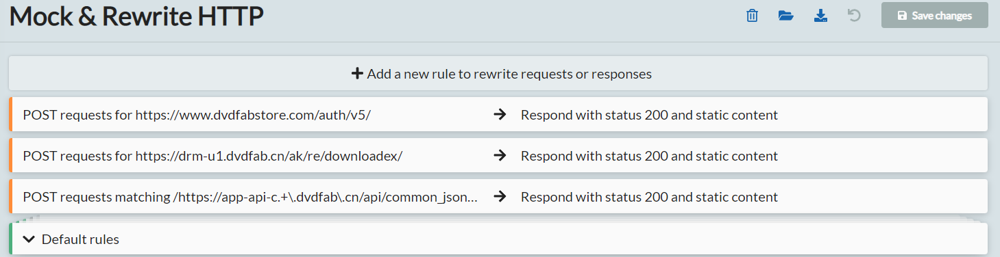
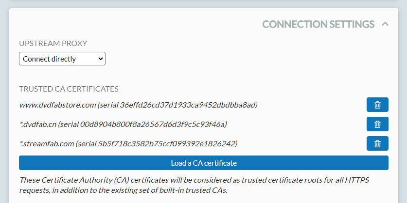
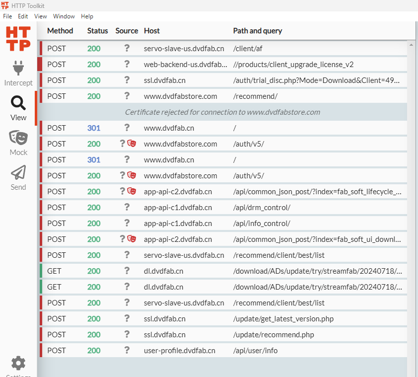

# DVDFab 365 Lifetime Activation

A method to activate DVDFab products using a proxy approach that does not impact the integrity of application or system files.

> [!IMPORTANT]  
> Support for all future software that may be added to DVDFab products is not automatic and requires knowledge of the product ID.

## Features

- 🔓 Unlocks all VIP functionalities of DVDFab products
- ⚙️ Provides a seamless and non-intrusive activation method
- 🛡️ Ensures continued access without modifying application or system files
- 🚀 Removes the daily download limit
- 📊 Removes analytics data and automatic reports

## Prerequisites

1. **HTTP Toolkit**: Download and install from [httptoolkit.com](https://httptoolkit.com/)
2. **DVDFab Product**: Ensure you have the DVDFab product (e.g., StreamFab) installed on your system.

## Installation & Usage

### Step 1: Initial Setup

1. Launch the DVDFab product for the first time and log in with a free account. Close the software afterward.

### Step 2: Generate HTTP Toolkit Configuration

1. Ensure you have Python installed on your system.
2. Save the provided `rules.py` script to your local machine.
3. Run the script using the following command:
    ```shell
    python3 rules.py
    ```
4. This will generate an `HTTPToolkit_DVDFab.htkrules` file in the same directory.

### Step 3: Configure HTTP Toolkit

1. Open HTTP Toolkit.
2. Import the `HTTPToolkit_DVDFab.htkrules` file into the `Mock` tab in HTTP Toolkit.
   
3. Import the DVDFab CA certificates into the trusted certificates in HTTP Toolkit settings (requires Pro version).
   

### Step 4: Launch DVDFab Product

1. Launch a hooked terminal via `Fresh Terminal` or `Existing Terminal` in HTTP Toolkit.
2. Navigate to the folder containing the DVDFab product binary.
3. Launch the DVDFab product via the intercepted shell.

### Step 5: Handling MAC Detection Errors (Optional)

In case you encounter errors related to MAC detection:

1. **Save the provided `server.py` script** to your local machine.
2. Run the `server.py` script using:
    ```shell
    python3 server.py
    ```
3. This script will handle MAC detection issues by emulating a suitable response.

### Step 6: Enabling Additional Rules in HTTP Toolkit (If Needed)

1. **Access HTTP Toolkit Configuration:**
    - Go to the `Mock` tab where you imported the `HTTPToolkit_DVDFab.htkrules` file.
2. **Enable Additional Rules:**
    - In the rules configuration, locate the index `2` section. This rule is disabled by default.
    - Enable this rule to apply additional patches required for your specific configuration.

### Step 7: Enjoy Activated Features

1. The requests are now patched, and you can enjoy all functionalities.
   

## Licensing

This software is licensed under the terms of the [MIT License](LICENSE).  
You can find a copy of the license in the LICENSE file in the root folder.